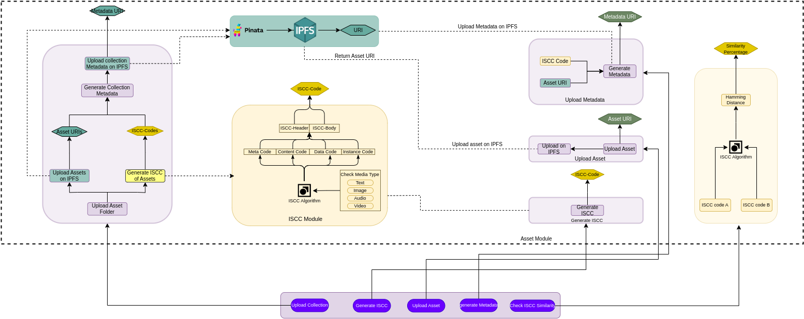
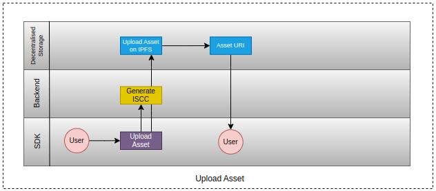
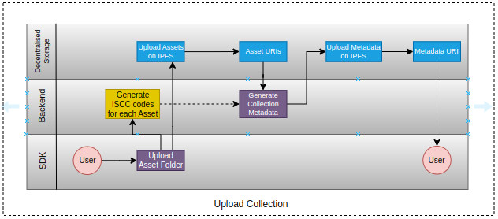
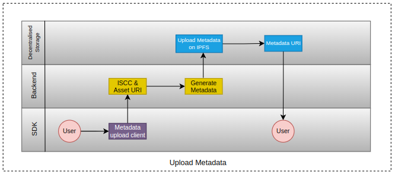

## Asset Module

Asset Module consists of the components which are used to-

- Upload the Asset to IPFS
- Generate the ISCC Codes for the Assets
- Create Metadata for IP or Collection
- Upload the Metadata to IPFS
- ISCC codes comparison

It uses the International Standard Content Code library to generate the ISCC code for the Asset and uses Pinata to upload the data to the IPFS.

### Upload Asset
As user uploads the Asset, sdk generates the ISCC code for it and uploads the Asset to the IPFS, returns the URI of the Asset.

### Upload Collection
When an Artist uploads the collection folder, the sdk generates ISCC for each Asset present in the collection and uploads the Assets to the IPFS, returns the URIs of the Assets.

### Upload Metadata
Metadata is generated using the ISCC code and Asset URI returned while uploading the Asset and other Metadata Fields, then the Metadata is uploaded to IPFS and user gets the Metadata URI in return.

