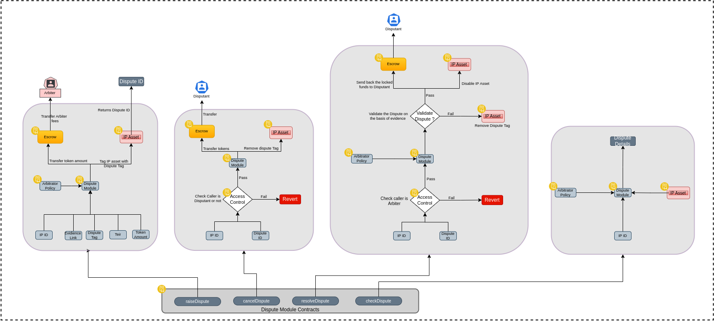
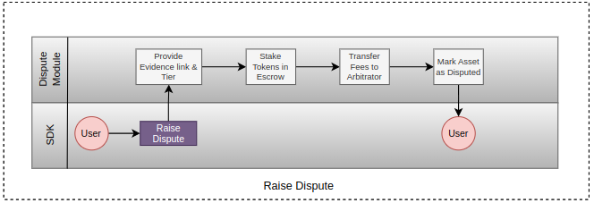
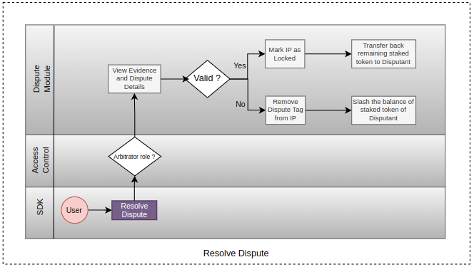

# Dispute Module

Dispute Module handles the dispute related tasks in the protocol, like -

* Raising Disputes
* Resolving Disputes
* Getting Dispute details
* Atbitrator management
* Dispute fee management

## Raise Dispute

To raise an Dispute, user has to enter Dispute Evidence Link, Dispute Tier and stake the tokens based on the Tier. The tokens are transferred to an Escrow Fee contract and Arbitrator fee is paid. After successful transaction the IP is marked as Disputed and stopped from creating further derivatives until the dispute is resolved.

## Resolve Dispute

Disputes can only be resolved by the Arbitrator. The Arbitrator reviews the Dispute Evidence and based on that checks the validation of the dispute. If the Dispute is valid, the remaining staked tokens are transferd back to the Disputant and the IP is Locked. If the dispute is not valid then remaining tokens are used by the platform and IP is untagged from Disputed.

