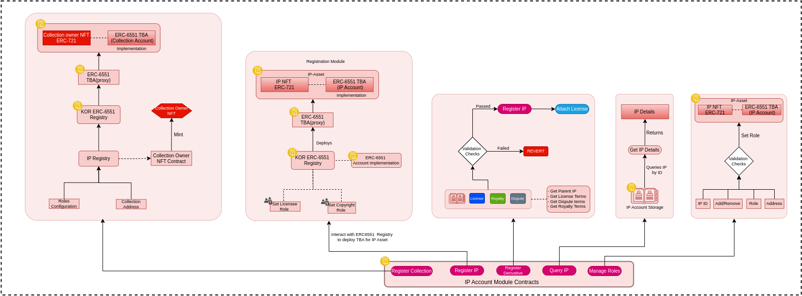
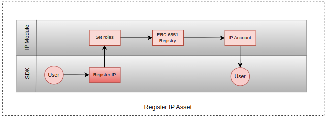
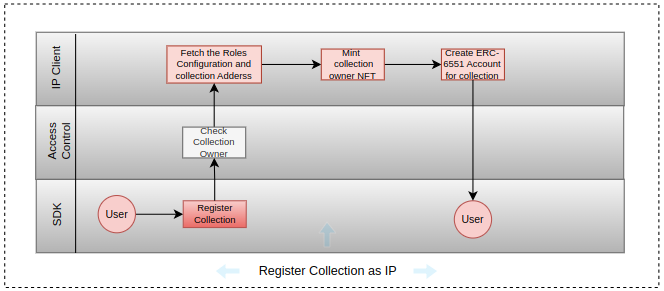

# IP Module

This module is responsible for the IP Asset related functionalities, like -

* Registering an NFT as IP Asset
* Creating KOR ERC-6551 Token Bound Accounts for the NFTs
* Managing Roles for an IP
* Registering derivatives
* Query of IPs
* Registering a collection as an IP

## Register IP Asset

The process of registering an NFT as a IP Asset includes configuring the roles for the IP Asset, for example Licensee Role, Copyright Role etc. then the IP Registry created an Token Bound Account for the NFT which is referred as IP Account.

## Register Collection as IP

To register a whole NFT collection as an IP user have to configure the Roles for the IP first, then sdk mints an NFT to the creator. This NFT represents the collection. Then sdk creates a KOR Token Bound Account (Modified ERC-6551) for the collection, which is referred as Collection Account.

