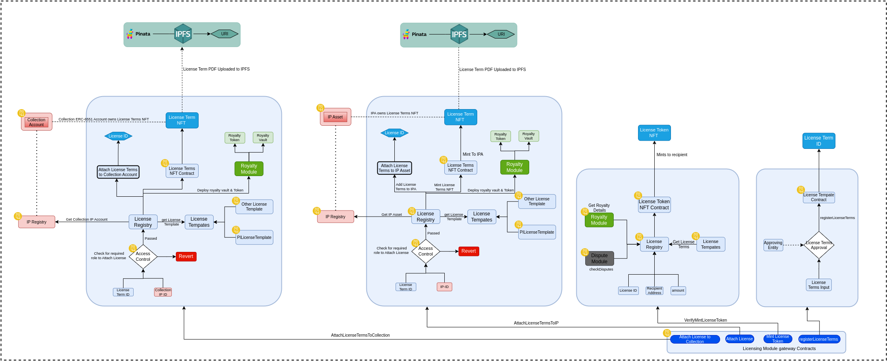
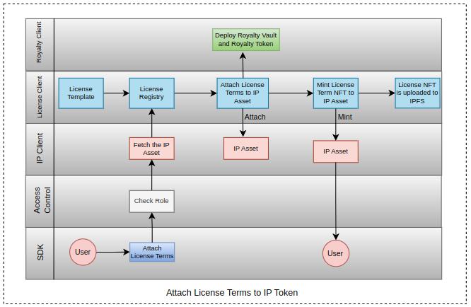
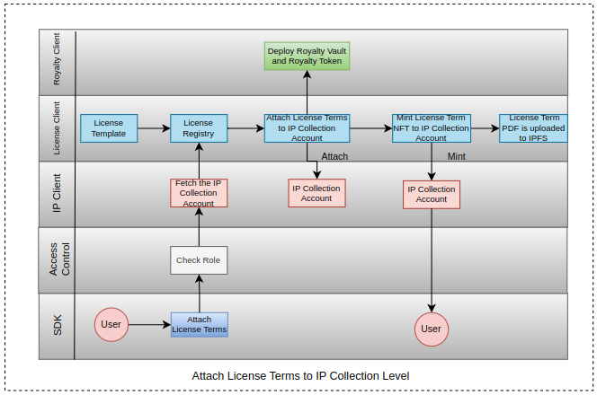

### License Module

This module is responsible for managing the Licensing of the IP, it provides functionalities like -

- Attaching the License Terms to an IP Asset.
- Attaching the License Terms to an IP Collection.
- Minting an License Token for derivative creation.
- Registering new License Terms.
- Minting License Terms NFT.
- Deploying Royalty Vaults and Royalty Token through Royalty Module.
- Uploading License Term PDF to IPFS.

### Attach License To IP
While attaching the License terms to the IP Asset, sdk first checks the role of the user which is attaching the license for the validation check. The License Registry takes the entered License Term ID and attaches it to the IP Account and Mints a new License Terms NFT into the IP Account. The pdf of License Terms is generated and uploaded to the IPFS. When License Terms are attached to the IP Account, a call to Royalty Module is made through License Registry to deploy Royalty Vault and Royalty Token for that IP Asset.

### Attach License Terms to Collection 
While attaching the License terms to the IP Collection, sdk first checks the role of the user which is attaching the license for the validation check. The License Registry takes the entered License Term ID and attaches it to the Collection Account and Mints a new License Terms NFT into the Collection Account. The pdf of License Terms is generated and uploaded to the IPFS. When License Terms are attached to the Collection Account, a call to Royalty Module is made through License Registry to deploy Royalty Vault and Royalty Token for that IP Colelction.

