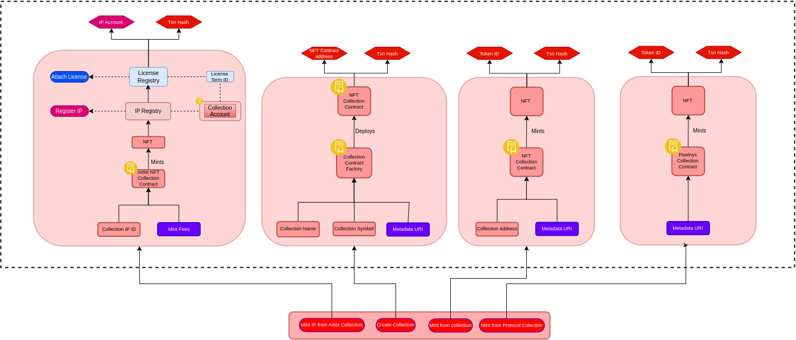
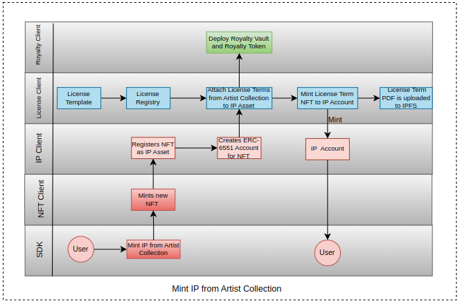

# NFT Module

NFT Module consists of set of Smart Contracts which allows users and Artists to -

* Create their own NFT Collection.
* Mint NFT from the Collection and further use it to register as an IP.
* Create their own IP Collection.
* Directly mint an IP from IP Collection.
* Mint NFT from protocol NFT Contract.

It consists of contracts developed using various ERCs and modifying them accordingly.

## Mint IP from the Collection

Minting IP from a Artist IP Collection mints an IP Asset directly to user without having a need to register the NFT and attaching License Terms to it. SDK mints an NFT from the Artist Collection, registers it as an IP, attaches the License terms to it as defined in the Collection IP Account and mints this IP Asset to user. This process is done in one go.

