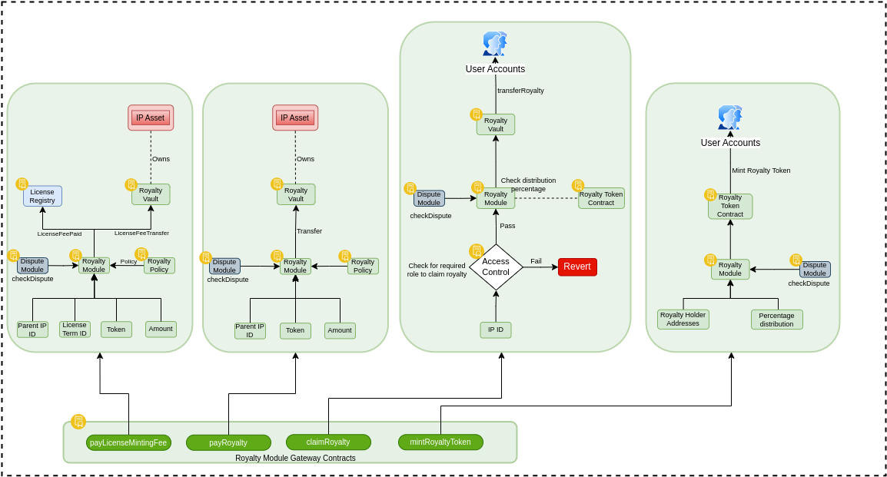
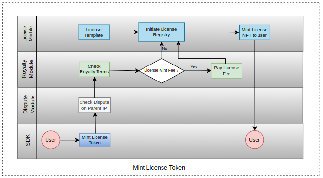
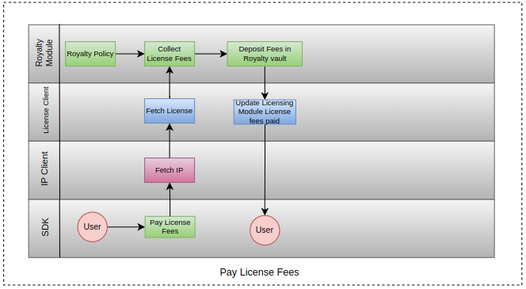
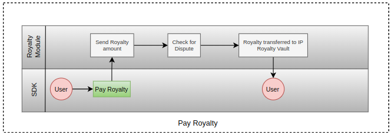
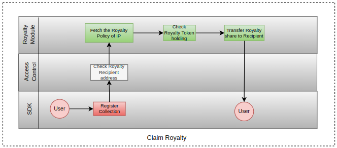

# Royalty Module

Royalty Module handles all the Royalty related tasks for an IP, like-

* Paying Royalties
* Claiming Royalties
* Deploying Royalty Tokens and Royalty Vaults through factory contracts.
* Royalty calculation
* Royalty Distribution
* License Fees Management

## Mint License Token

To mint License Token of an IP Asset, sdk first checks if there is any dispute over that IP Asset, then checks for the Royalty Policy/Terms is there is any License Mint Fees applicaple then user has to pay the License Mint Fees and it is transferred to the Royalty Vault of the IP. On successful transaction, the License Token is minted to the user.

## Pay License Mint Fees

License Mint Fees is defined in the License Terms attached to an IP. The License Mint Fees is collected by Royalty Module into the Royalty Vault of an IP Asset.

## Pay Royalty

Users can pay Royalties to an IP. The Royalty module checks for the dispute, then transfers the Royalty to the Royalty Vault of the IP.

## Claim Royalty

To claim Royalty, SDK first checks for the Roles of the caller. Then it fetches the Royalty share based on the Royalty Tokens holding of the Recipient and transfers the Royalty from the Royalty Vault.

