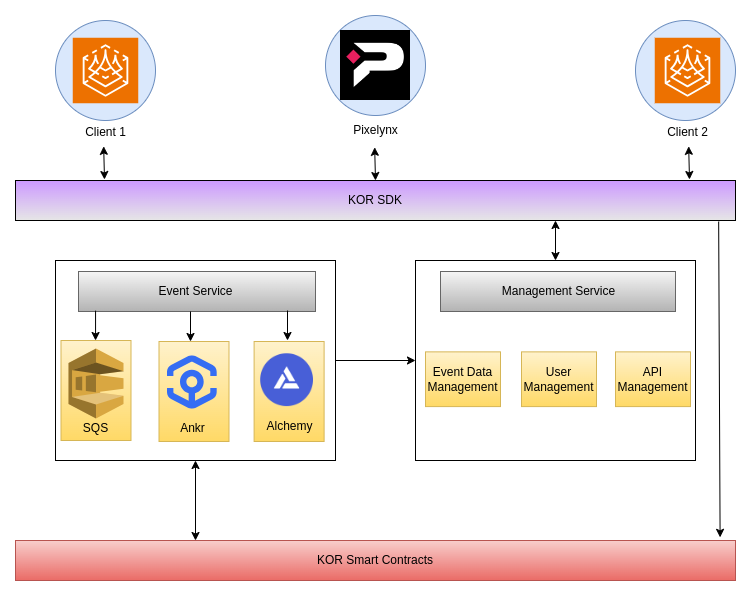

# Overview

The KOR SDK architecture is composed of six distinct modules:

* Asset Module
* NFT Module
* IP Module
* License Module
* Royalty Module
* Dispute Module

These modules are designed to perform specific functions within the protocol. They are engineered to work seamlessly together, enabling the execution of complex operations.

Four of these modules - IP, License, Royalty, and Dispute - are coordinated by the Orchestrator Architecture. This approach streamlines the system, reducing complexity and improving overall code organisation.

