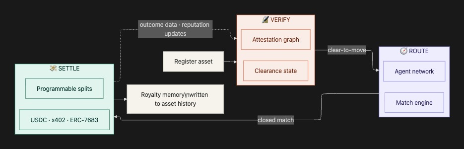

# How KOR Protocol Works

The protocol implements three engines—Verify, Route, Settle—through a layered architecture: **SDK → Backend → Blockchain**. The SDK talks to our backend, the backend signs transactions, your user's wallet submits them. Keeps blockchain complexity out of the way while preserving security guarantees.

***

## The Loop

Every operation flows through the same cycle:



**Registration.** A creator registers an asset. The registration creates a canonical on-chain identifier, an attestation graph seeded with the initial ownership claim, and a clearance state derived from the graph.

**Routing.** Once an asset is registered and clear-to-move, it can be routed toward partners. _(Route Engine in development)_

**Settlement.** A closed match clears through the Settle layer. Splits are programmatic, denominated in stablecoin, executed atomically across participants.

**Feedback.** Each settlement writes back to the protocol. The asset accumulates royalty history—timestamps, counterparties, deal terms.

***

## Architecture

```
┌─────────────────────────────────────────────────────────────────┐
│                        YOUR APPLICATION                         │
└─────────────────────────────────────────────────────────────────┘
                               │
                               ▼
┌─────────────────────────────────────────────────────────────────┐
│                         KOR SDK                                 │
│            TypeScript. Handles API calls + tx submission.       │
└─────────────────────────────────────────────────────────────────┘
                               │
                    ┌──────────┴──────────┐
                    ▼                     ▼
┌───────────────────────────┐  ┌──────────────────────────────────┐
│      KOR BACKEND          │  │         USER WALLET              │
│  Validates, encodes,      │  │  MetaMask, Coinbase, whatever.   │
│  signs tx data            │  │  Signs + pays gas.               │
└───────────────────────────┘  └──────────────────────────────────┘
                    │                     │
                    └──────────┬──────────┘
                               ▼
┌─────────────────────────────────────────────────────────────────┐
│                      BASE NETWORK                               │
│                                                                 │
│  ┌─────────────────────────────────────────────────────────┐   │
│  │                    VERIFY ENGINE                         │   │
│  │  ┌─────────────┐  ┌─────────────┐  ┌─────────────┐      │   │
│  │  │ NFT Module  │  │  IP Module  │  │Asset Module │      │   │
│  │  └─────────────┘  └─────────────┘  └─────────────┘      │   │
│  └─────────────────────────────────────────────────────────┘   │
│                                                                 │
│  ┌─────────────────────────────────────────────────────────┐   │
│  │                    SETTLE ENGINE                         │   │
│  │  ┌─────────────┐  ┌─────────────┐  ┌─────────────┐      │   │
│  │  │License Module│ │Royalty Module│ │Dispute Module│     │   │
│  │  └─────────────┘  └─────────────┘  └─────────────┘      │   │
│  └─────────────────────────────────────────────────────────┘   │
│                                                                 │
│  ┌─────────────────────────────────────────────────────────┐   │
│  │                  TOKEN-BOUND ACCOUNTS                    │   │
│  │                     (ERC-6551)                           │   │
│  └─────────────────────────────────────────────────────────┘   │
└─────────────────────────────────────────────────────────────────┘
```

***

## Transaction Flow

Every operation follows the same two-step pattern:

**Step 1: Get signature from backend**

Your app calls the SDK. SDK hits our backend. Backend validates your API key, encodes the transaction, signs it, sends back the signature + encoded data.

**Step 2: User wallet submits**

SDK takes that payload and routes it through the user's wallet. User sees the transaction, confirms, pays gas (fractions of a cent on Base).

Why this pattern? Users stay in control of their assets. They sign every transaction. But the protocol can still validate and authorize operations server-side.

```typescript
// Register an NFT as IP
const { request } = await kor.ip.registerIp({
  nftContract: "0x...",
  tokenId: "1",
  licensors: [{ licensorAddress: "0x...", licensorPercentage: 100 }]
});

// User signs and submits
const txHash = await walletClient.writeContract(request);
```

***

## Verify Engine Modules

The Verify Engine establishes origin, ownership, and clearance state. Three modules:

### NFT Module

Creates and manages collections.

| Function               | What it does                                        |
| ---------------------- | --------------------------------------------------- |
| `createCollection`     | Deploy a new ERC-721 collection                     |
| `createIpCollection`   | Deploy a collection where mints auto-register as IP |
| `mint`                 | Mint to a collection                                |
| `mintFromIpCollection` | Mint + auto-register as IP Asset                    |

### IP Module

The core registration layer. Registers NFTs as IP and creates token-bound accounts.

| Function                   | What it does                               |
| -------------------------- | ------------------------------------------ |
| `registerIp`               | Register any NFT as an IP Asset            |
| `registerIpFromCollection` | Register with collection-level licensing   |
| `registerDerivative`       | Register work that derives from parent IP  |
| `getIpAccount`             | Get the ERC-6551 account address for an IP |

Each registration creates:

* A canonical on-chain identifier (ERC-721 token)
* An off-chain content pointer (IPFS or Arweave hash)
* Metadata describing format, creation context, and AI-provenance status

### Asset Module

Off-chain metadata and storage.

| Function           | What it does                    |
| ------------------ | ------------------------------- |
| `uploadAsset`      | Upload to decentralized storage |
| `getAssetMetadata` | Retrieve metadata               |

***

## Settle Engine Modules

The Settle Engine clears value across participants. Three modules:

### License Module

Attaches terms to IP.

| Function          | What it does                          |
| ----------------- | ------------------------------------- |
| `attachLicense`   | Attach license terms to an IP Asset   |
| `mintLicense`     | Mint a license token for usage rights |
| `getLicenseTerms` | Query terms for an IP                 |

### Royalty Module

Handles splits and distributions.

| Function              | What it does                         |
| --------------------- | ------------------------------------ |
| `setRoyaltySplit`     | Define percentages for collaborators |
| `distributeRoyalties` | Trigger distribution                 |
| `claimRoyalties`      | Claim what's owed                    |

Splits are declared at asset registration and updated as commercial relationships evolve. A track with three producers, one vocalist, a manager on 10%, and a label on 15% has those splits encoded from registration. When revenue arrives, the settlement contract distributes atomically.

### Dispute Module

For ownership disputes.

| Function         | What it does          |
| ---------------- | --------------------- |
| `raiseDispute`   | Initiate dispute      |
| `resolveDispute` | Resolve with evidence |

***

## Token-Bound Accounts (ERC-6551)

Every IP Asset registered on the protocol gets its own smart contract wallet. Not a wallet controlled by the creator—a wallet controlled by the IP itself.

```
┌─────────────────────────────────────────┐
│            NFT (IP Asset)               │
│         Contract: 0xABC...              │
│         Token ID: 42                    │
└─────────────────────────────────────────┘
                    │
                    │ ERC-6551 Registry creates
                    ▼
┌─────────────────────────────────────────┐
│      Token-Bound Account (TBA)          │
│         Address: 0xDEF...               │
│                                         │
│  → Receives royalty payments            │
│  → Holds licensing revenue              │
│  → Can own other assets                 │
│  → Controlled by NFT owner              │
└─────────────────────────────────────────┘
```

**IP can hold assets.** Revenue flows to the IP, not just the creator's wallet. Makes accounting cleaner when rights structures get complex.

**Programmable ownership.** The wallet executes transactions on behalf of the IP. Royalties split automatically. Licenses execute without manual intervention.

**Portable identity.** The IP has an onchain identity that persists across platforms. History, reputation, relationships travel with it.

When someone licenses your IP or a derivative generates revenue, payments go to the token-bound account. The NFT owner can withdraw whenever they want.

***

## Clearance State

Clearance state is a derived property of an asset's attestation graph. An asset is "clear-to-move" for a given action when the graph satisfies the conditions required for that action.

Different actions require different conditions:

* **Transient license** requires only unambiguous ownership
* **Sample license** requires unambiguous ownership plus consistency with the source's terms
* **Full transfer** requires the above plus absence of conflicting authorship claims

Downstream contracts check clearance state before acting. A settlement contract won't clear a license payment if the licensor can't be unambiguously identified.

***

## Network Details

### Base Sepolia (Testnet)

| Contract    | Address                                                       |
| ----------- | ------------------------------------------------------------- |
| NFT Module  | `0x7797A484C7a9aAa238D40476A022E5C5e3e2e0e3`                  |
| IP Module   | `0xd97fEB28aD630A3f8561a0decee0fed26842b718`                  |
| Backend API | `https://backend-production-a7215.up.railway.app/kor-sdk-api` |

Chain ID: `84532`

### Base Mainnet

Coming.

***

## What's Coming

### Route Engine

The Route Engine moves verified assets toward demand-side parties through specialized agents:

* **A\&R agents** scan signal for emerging talent matching a partner's discovery brief
* **Sync-licensing agents** match assets to brand briefs and music supervision needs
* **Partner-matching agents** route assets to specific demand-side parties

Agents will be registered with on-chain identity (ERC-8004), declared capability surfaces, and bonded reputation scores.

### Agent-Ready Payments

x402 is an open standard for HTTP-native stablecoin payments. Every registered asset will expose an x402-compatible endpoint for transient licensing and usage payments. An autonomous agent issues an HTTP request, receives a 402 response with payment requirements, executes USDC payment, and receives the resource with a verifiable receipt.

### Chain-Abstracted Settlement

Cross-chain settlement via ERC-7683 intents. A participant signs an intent ("pay me," "license this catalog"). A solver network competes to fulfill across whatever combination of chains and stablecoins produces the best execution.

***

## What You Can Build

**Creator platforms** — register user content as IP, automate royalties on remixes

**Music distribution** — manage releases as IP Assets, split royalties between artists/producers/labels automatically

**AI training marketplaces** — license IP for model training with programmable usage rights

**Digital art galleries** — verify authenticity, track provenance through derivatives

**Brand partnership platforms** — match creators with brands, settle instantly on crypto rails

***

## Next

* [Developer Onboarding](developer-onboarding.md) — set up your environment
* [SDK Reference](../Sdk-Reference/introduction.md) — full API docs
* [Key Business Flows](../Key-Flow/flow.md) — common patterns
