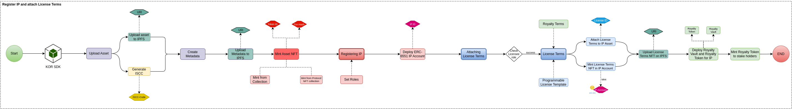
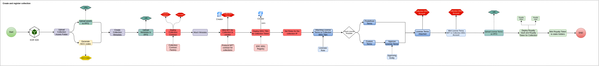
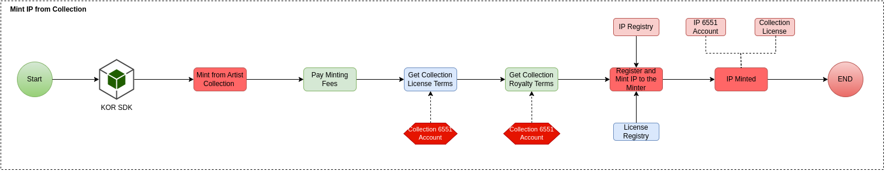
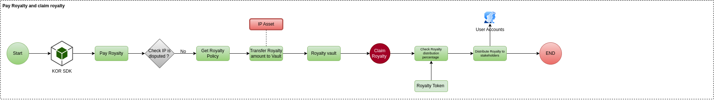
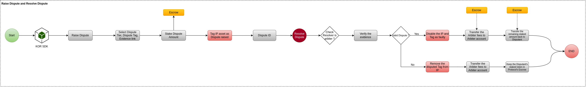

# Key Flow

## User Flows

### Register IP and attach License

This flow shows how an NFT is Registered as an IP Asset and how a License Term is attached to it.

### Create and register a collection as IP

This flow represents how an Artist can create their own collection and set the License terms to Collection level.

### Mint IP from artist IP collection

This flow shows how a user can directly mint an IP Asset from artist by paying IP Minting fees(if Applicable).

### Mint License Token and register derivative

This flow shows how a user can mint a License Token of an IP and use it to create derivatives

### Pay royalty and claim royalty

This flow shows the process of paying royalty to an IP and claiming the Royalties from the IP Vault based on royalty token holdings.

### Raise dispute and resolve dispute

This user flow shoes the process of raising dispute over an IP and process of resolving it.

